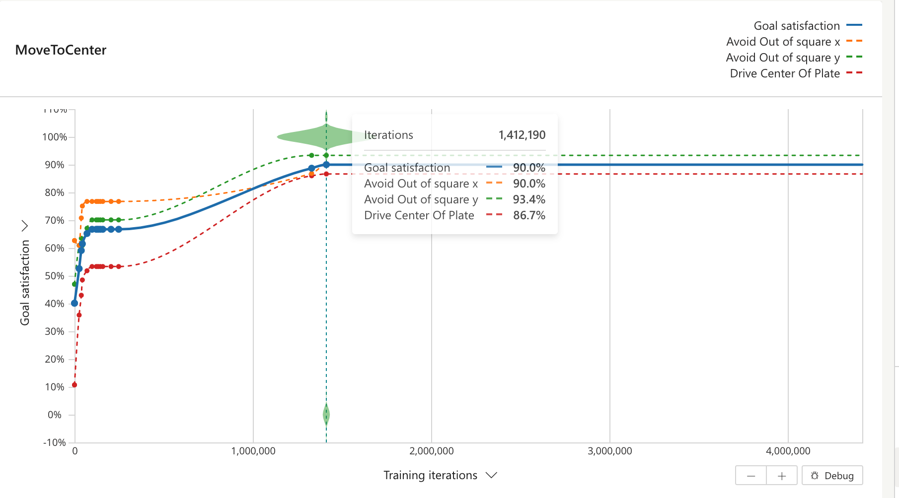

# Use case: control type 1a (see Problem Types (insert link here))
## Use case problem

Control problems are problems where the goal is to find optimal next action to optimize certain objective given constraints for a system in a sequential process. For example, if we consider Moab as a system then the objective is to move the ball to the center of the plate as soon as possible. Constraints are the physical boundaries of the plate, and actions are the pitch and roll angle command that the controller (or brain) needs to take at each time step to optimize the objective. Control problem are the most direct application of reinforcement learning seen in the literature. 

**Control Type 1 definition:** Immediate Objective function with Single State Constraint. Immediate Objective function with Single State Constraint.

### Objective and constraints

We define a problem in Moab such that it illustrates a Control Type 1: 
- Objective: Balance the ball at the center of the plate
- Constraints: Avoid the ball stepping outside a square 
  - single state constraint 1: $-a<ball_x<a$
  - single state constraint 2: $-a<ball_y<a$

## Problem simulation description

- The model *moab* simulates an ball being balanced on a plate. Written in `python`.
- Control problem description:

|                        | Definition                                                   | Notes |
| ---------------------- | ------------------------------------------------------------ | ----- |
| Objective              |  minimize the distance between position of the ball [$ball_x$, $ball_y$] to the center of the plate    |                          |
| Constraints            | $-a<ball_x<a$ and $-a<ball_y<a$  | stay within a square of side $a$
| Observations           | [ball_x, ball_y, ball_vel_x, ball_vel_y] | continuous values |
| Actions                |  [input_pitch, input_roll]| continuous values |
| Control Frequency      | ? | |
| Episode configurations | 250 iterations per episode, episode terminates if ball steps outside the square, random initial position and velocity, random initial pitch and roll | |

## Solution approach

#### High level solution architecture

- We use goals to express the objective and two single state constraints

#### Brain experiment card

|                        | Definition                                                   | Notes |
| ---------------------- | ------------------------------------------------------------ | ----- |
| State                  | ball_x, ball_y, ball_vel_x, ball_vel_y]                       |       |
| Terminal               |     N/A (using goals)      |       |
| Action                 |                [input_pitch, input_roll]     |       |
| Reward or Goal         |       see inkling           |    using goals   |
| Episode configurations |  250 iterations per episode, episode terminates if ball steps outside the square, random initial position and velocity, random initial pitch and roll                              |       |

### Results

