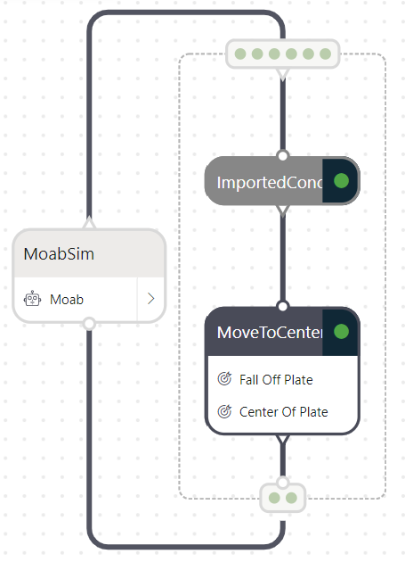
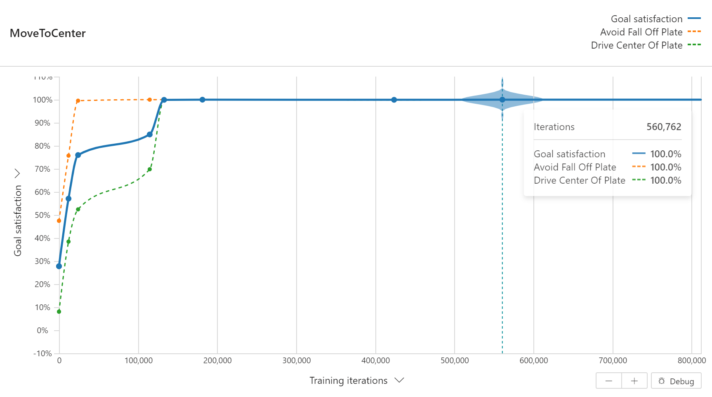
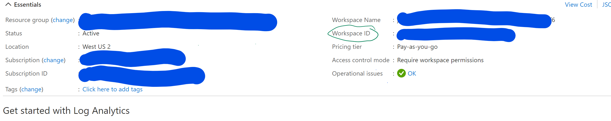

# How To: build and import a tensorflow-keras model in bonsai

This sample illustrates how to import a Machine Learning [ML] model in Bonsai:
1. We build a ML model using tensorflow-keras
   1. note: other frameworks such as pure Tensorflow are supported, in this sample we focus on Keras
   2. We illustrate by building a dummy deep transform:
      1. A Keras model (deep neural net) that transforms the input by applying a non linear transformation

2. Save the ML model as either
   1. `tensorflow SavedModel` format OR
   2. `onnx` format
3. Import the saved model to the Bonsai platform using `bonsai-cli`
4. Use it in the Moab example.



## Requirements
1. Create a conda virtual environment using the `environment.yml`.
    `conda env create -f environment.yml`
2. Currently only ML models compatible with tensorflow v1.15.2 are supported [(Link to docs)](https://docs.microsoft.com/en-us/bonsai/guides/import-ml-models?tabs=onnx%2Cnested1).
3. When saving a Keras model as a Tensorflow SavedModel, one needs to save it using `tf.saved_model.builder.SavedModelBuilder()`. Saving a Keras model using the direct `model.save()` is currently incompatible with Bonsai model import. (see *state_transform_keras_model.ipynb* Jupyter notebook)

## Usage
1. Using the *state_transform_keras_model.ipynb* notebook
   1. Build a tensorflow-keras model
   2. Save the ML model as `tensorflow SavedModel` format OR `onnx` format
2. Compressing the model as a `.zip`
   1. If the ML model is saved as a `tensorflow SavedModel`, compress the saved_model folder as a `.zip`
   2. If the ML model is saved as `.onnx`, there is no need to compress as `.zip`
3. Import the ML model to bonsai
   1. `tensorflow SavedModel` format OR
        ```
        bonsai importedmodel create 
            --name <ml-model-name> 
            --modelfilepath ./state_transform_deep.zip 
            --description "state transform tf SavedModel" 
            --display-name <ml-model-name>
        ```
   2. `onnx` format
        ```
        bonsai importedmodel create 
            --name <ml-model-name> 
            --modelfilepath ./state_transform_deep.onnx
            --description "state transform ONNX" 
            --display-name <ml-model-name>
        ```
 1. Use the imported model to train your brain using a Moab sample
    1. On preview.bons.ai
       1. Create a new brain from a "Moab sample"
       2. Copy paste the inkling from *moab-imported-concept.ink* in the *Teach* panel UI. In this sample we use the imported ML model to transform the state before passing it as a brain input (see inkling excerpt below).
       ```
       graph (input: ObservableState) {
           concept ImportedConcept(input): ObservableState {
               import {Model: <ml-model-name> } 
           }
           concept MoveToCenter(ImportedConcept): SimAction {
               ...    
           }
           output MoveToCenter    
       }
       ```
    2. Build the ML model as an imported concept named ImportedConcept: click `Build ImportedConcept` 
    3. Trained the brain: click `Train MoveToCenter` (see below for an expected brain training graph) 
        

## Pytest

Run a pytest to import a model, build the concept, train moab with the model as input, use custom assessment, and assert performance from logs from your Log Analytics Workspace.

```bash
pytest tests\test_model_import.py -s \
    --brain_name <BRAIN_NAME> \
    --log_analy_workspace <LAW_WORKSPACE_ID> \
    --custom_assess_name <CUSTOM_ASSESSMENT_NAME> \
    --model_file_path "./Machine-Teaching-Examples/model_import/state_transform_deep.zip"

    or 
    --model_file_path "./Machine-Teaching-Examples/model_import/state_transform_deep.onnx"
```

Be sure to use your `workspace id` and not your `workspace name` in your Log Analytics Workspace within Azure Portal.

